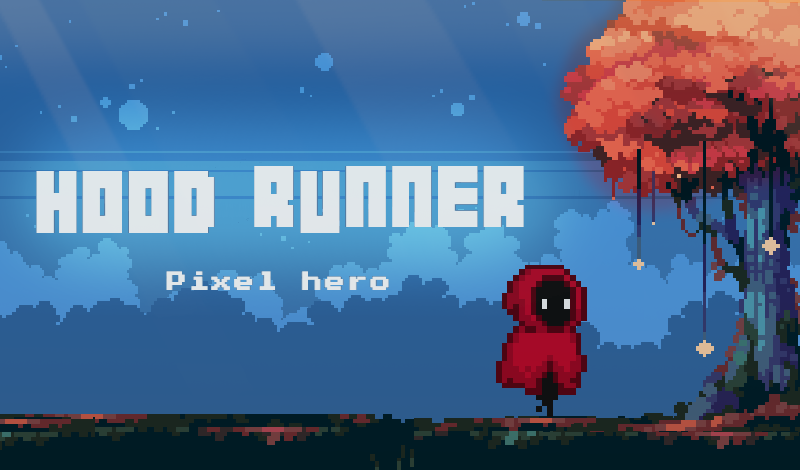

# Hood Runner 

Hood Runner is a fascinating endless 2D runner in the style of Pixel Art.

The project is written in JS using Canvas JS.
All game assets are taken from open sources.

## Description
Help the mysterious hero in the red hood to overcome all the obstacles in his way.
Collect all the achievements and complete the game!
## About
Jump over obstacles, dodge platforms floating in the air and trees hanging from the ceiling. Collect boosters, pump them for coins, move on, collect new achievements and most importantly - beat your previous record.

Controls
WASD keys or touch control
## Play
Or you can play <a href='https://mkh1n.github.io/hood-runner/'>here</a>.
