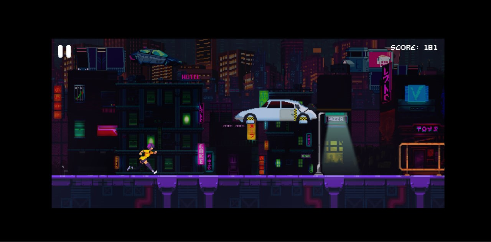
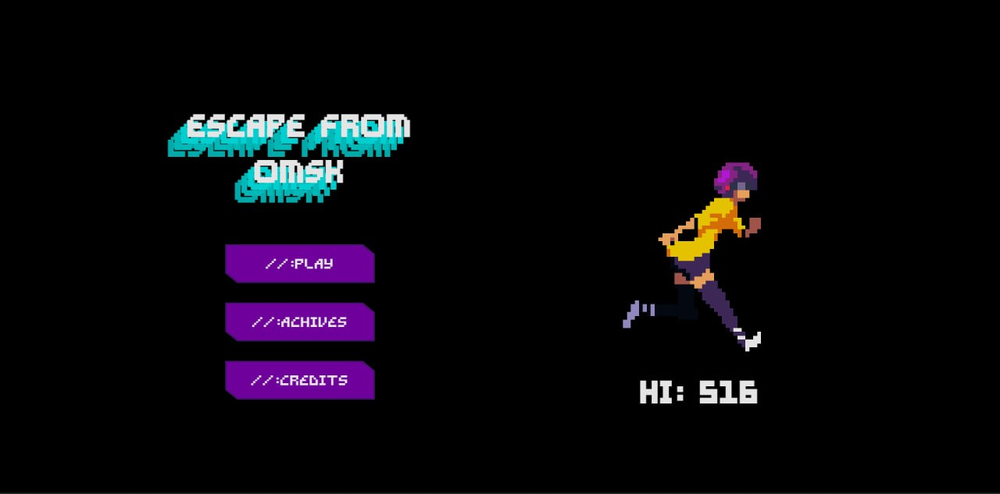
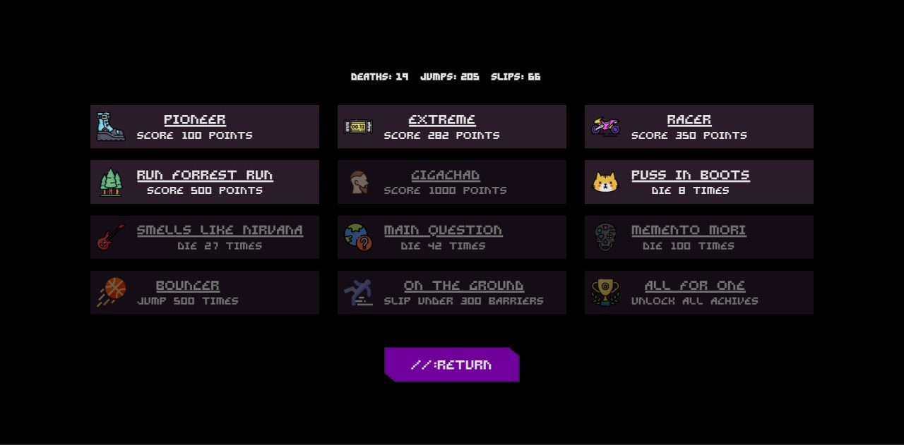
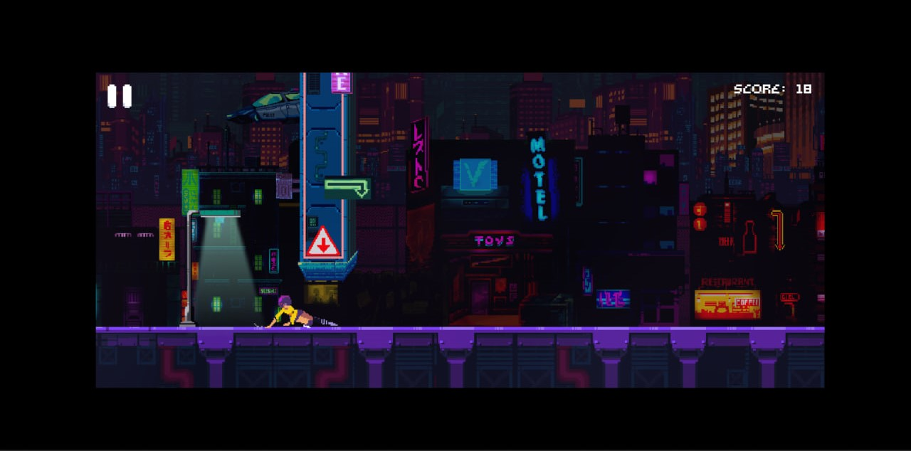

# Escape from Omsk 

A simple endless runner with randomly generated obstacles. You can jump, slide on the ground and move right and left. The character is controlled using the WASD keys or arrows. All the cassettes used in this game were taken from open sources. 
The game works using Canvas js.

    
    

The game locally saves the player's best score and his statistics - the number of jumps, deaths and slips. The game has an achievement system.

 

<a href='https://moxa-rumin.github.io/escape-from-omsk/'><a>

